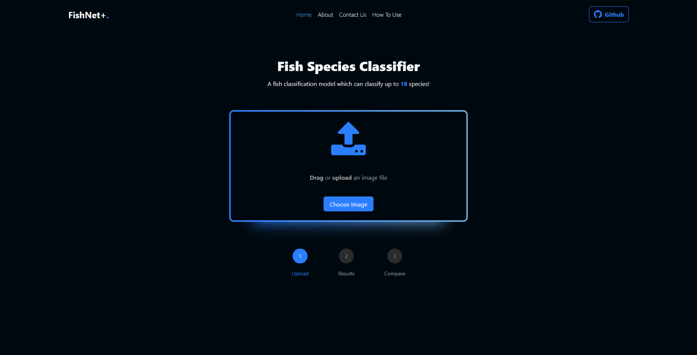
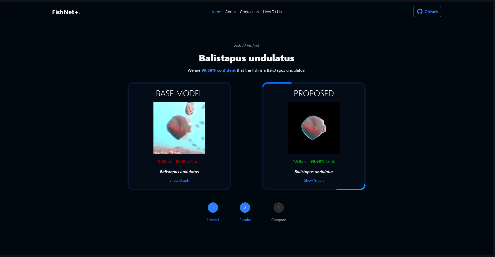
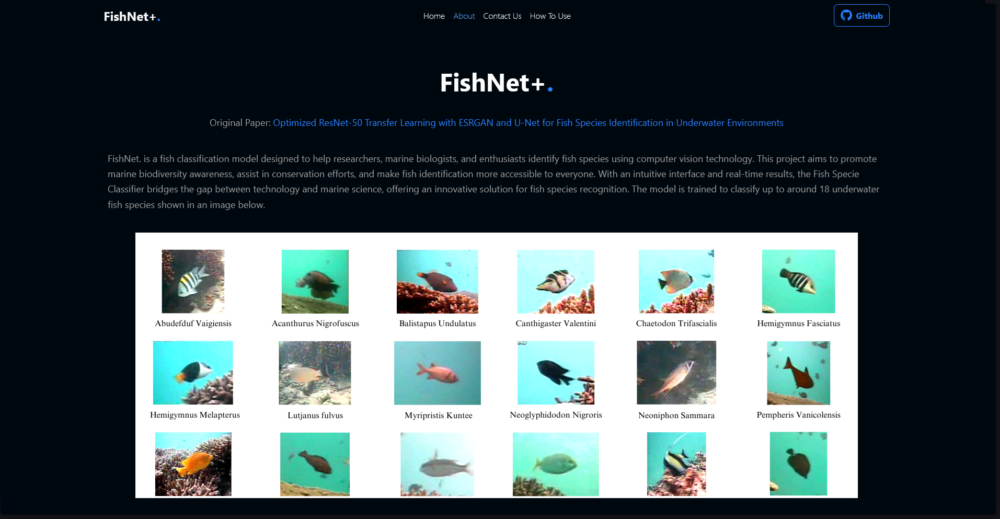

# 🐟 FishNet+

A machine learning project for recognizing fish species from images.

## Project Structure

```
fish-specie-recognition/
├── data/                # Datasets and images
├── models/              # Saved and trained models
├── notebooks/           # Jupyter notebooks for experiments
├── src/                 # Source code for training and inference
│   ├── data/            # Data loading and preprocessing scripts
│   ├── models/          # Model architectures and utilities
│   └── utils/           # Helper functions
├── requirements.txt     # Python dependencies
├── README.md            # Project documentation
```

## Getting Started

1. **Clone the repository:**

   ```bash
   git clone https://github.com/kruizo/fish-specie-recognition.git
   cd fish-specie-recognition
   ```

2. **Create & Activate Virtual Environment**

   For WIndows (Permission may be required to run scripts):

   ```bash
   ./activate.bat
   ```

   Alternatively,

   ```bash
   python3 -m venv venv
   source venv/bin/activate
   ```

3. **Install dependencies:**

   ```bash
   pip install -r requirements.txt
   ```

   For CUDA supported devices, Run the following:

   ```bash
   python init.py
   ```

4. **Run the application**

   For Windows:

   ```bash
   ./serve.bat
   ```

   Alternatively,

   ```bash
   python app.py
   ```

5. **View training & experiments:**
   - Training notebooks can be found in `github.com/kruizo/model-training`.

## Screenshots





## Acknowledgements

- This project is a thesis requirement with baseline from FishResNet study.
